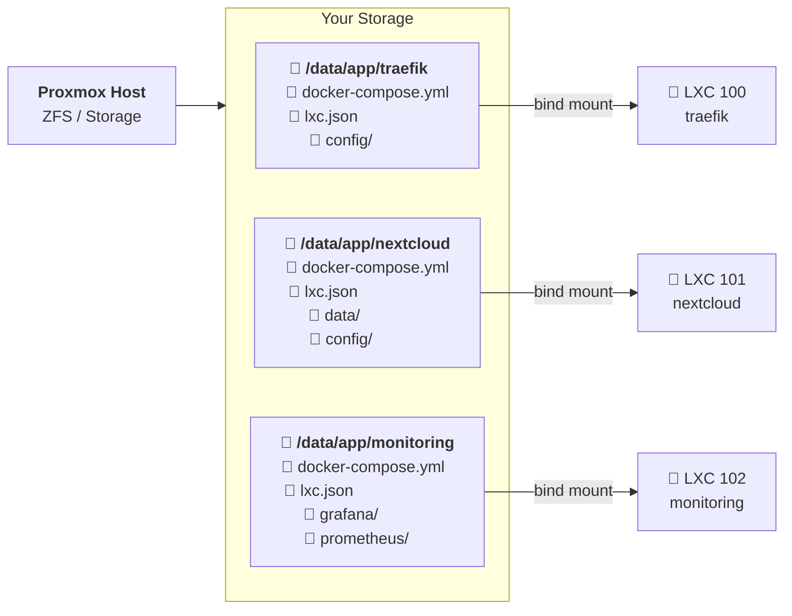

# pve-compose

**One Compose stack per LXC. Fully automated. Backed up by your storage.**

If you manage Docker Compose stacks manually and want each one isolated in its own LXC container — with its own resources, its own restart, its own backup — pve-compose does it all for you. Write a `docker-compose.yml`, run `pve-compose up -d`, done.

## How It Works

Your current directory **is** the project. pve-compose uses `$PWD` as the source of truth:



Each folder contains the `docker-compose.yml` **and** its persistent data (volumes, configs). pve-compose creates an LXC, mounts that folder inside it at `/data`, installs Docker, and runs `docker compose up -d`.

### The key insight: your storage _is_ the backup

When you keep compose volumes as local directories (not Docker-managed volumes), everything lives in one place — your storage. With ZFS, Ceph, or any Proxmox-managed storage:

- **ZFS snapshots** = instant point-in-time backup of all services
- **ZFS replication** = offsite copy, automated
- **Disk mirroring** (mirror/raidz) = redundancy built in
- **No backup jobs needed** — no `vzdump`, no Docker volume exports, no cron scripts

The whole `/data/app/` tree — every compose file, every config, every database file — is protected at the storage level. Clone the disk, replicate it, snapshot it. That's your backup plan.

> **This is Infrastructure as Code by convention.** Each folder is a self-contained, portable service definition. Copy the folder to another Proxmox host, run `pve-compose up -d`, same stack.

## Features

- **Zero-config** — drop a `docker-compose.yml` in a folder, run `pve-compose up -d`
- **`$PWD` is the context** — always run pve-compose from the folder with your `docker-compose.yml`
- **Template cloning** — create a Docker-ready template once, clone in ~10 seconds
- **Fast path** — subsequent `up` on running containers completes in < 0.5s
- **Full compose pass-through** — `logs`, `exec`, `ps`, `pull`, `restart`, and 25+ more
- **Health checks** — `pve-compose doctor` validates Docker, DNS, mount, compose
- **Hot-apply** — `pve-compose apply` changes memory, CPU, tags without restart
- **Interactive wizard** — TUI menus for setup and template creation
- **Pure POSIX shell** — `sh` + `jq`. Runs on any Proxmox host out of the box
- **Bash completion** — tab-complete commands, flags, and service names

## Requirements

- Proxmox VE 7.x or 8.x
- `jq` (`apt install jq`)

## Quick Start

```bash
# 1. Install
curl -sL https://github.com/PoBruno/pve-compose/releases/latest/download/pve-compose_all.deb \
  -o /tmp/pve-compose.deb && dpkg -i /tmp/pve-compose.deb

# 2. Initialize (auto-detects your Proxmox environment)
pve-compose setup

# 3. Create a Docker-ready template (optional, but recommended)
pve-compose template create

# 4. Deploy a service
mkdir -p /data/app/speedtest && cd /data/app/speedtest

cat > docker-compose.yml <<'EOF'
services:
  speedtest:
    image: lscr.io/linuxserver/speedtest-tracker:latest
    ports:
      - "8080:80"
EOF

pve-compose up -d

# 5. Check it
pve-compose status
pve-compose doctor
pve-compose logs -f
```

That's it. An LXC container was created, Docker was installed, your directory was bind-mounted, and the compose stack is running.

## Install

**From .deb package** (recommended):

```bash
dpkg -i pve-compose_0.1.0-1_all.deb
```

**From source**:

```bash
git clone https://github.com/PoBruno/pve-compose.git
cd pve-compose
make install
```

**Uninstall**:

```bash
dpkg -r pve-compose
# or: make uninstall
```

## Usage

### Core Commands

| Command | Description |
|---|---|
| `pve-compose setup` | Configure global defaults (interactive wizard) |
| `pve-compose template create` | Build a Docker-ready LXC template (~2 min) |
| `pve-compose plan` | Preview resolved config, generate `lxc.json` |
| `pve-compose up -d` | Create LXC + install Docker + start compose |
| `pve-compose status` | Show container and service status |
| `pve-compose doctor` | Run 10 health checks on the project |
| `pve-compose apply` | Apply `lxc.json` changes to existing container |
| `pve-compose destroy` | Tear down compose + stop + destroy LXC |
| `pve-compose shell` | Open a shell inside the LXC |
| `pve-compose overview` | List Docker containers across all LXCs |

### Docker Compose Pass-through

All standard `docker compose` commands are forwarded to the container:

```bash
pve-compose logs -f              # follow logs
pve-compose exec -it app bash    # shell into a service
pve-compose ps -a                # list containers
pve-compose pull                 # pull latest images
pve-compose restart              # restart services
pve-compose down                 # stop and remove containers
```

28 commands supported: `attach` `build` `commit` `config` `cp` `create` `down` `events` `exec` `export` `images` `kill` `logs` `ls` `pause` `port` `ps` `pull` `push` `restart` `rm` `run` `scale` `start` `stats` `stop` `top` `unpause` `wait` `watch`

### Workflow

**Zero-config** (simplest path):

```bash
mkdir myapp && cd myapp
# add your docker-compose.yml
pve-compose up -d
```

**With customization**:

```bash
mkdir myapp && cd myapp
# add your docker-compose.yml
pve-compose plan         # generates lxc.json with auto-detected values
nano lxc.json            # adjust memory, IP, storage, etc.
pve-compose up -d        # uses your customized config
```

## Lifecycle

```
$PWD (your project folder)
  │
  pve-compose up -d
  │
  ├── Generates lxc.json (if missing)
  ├── Creates LXC (or clones from template)
  ├── Bind-mounts $PWD → /data inside LXC
  ├── Installs Docker (if not present)
  └── Runs docker compose up -d
```

Every command (`status`, `logs`, `exec`, `down`, `destroy`, ...) works from the same folder — `$PWD` is always the context.

## Configuration

`pve-compose plan` auto-generates an `lxc.json` in your project directory:

```json
{
  "hostname": "speedtest",
  "ctid": 100,
  "storage": "local-zfs",
  "disk": "8G",
  "cores": 1,
  "memory": 1024,
  "swap": 512,
  "ipv4": "dhcp",
  "gateway": "192.168.1.1",
  "bridge": "vmbr0"
}
```

Every field is auto-detected. Edit only what you need to change.

See [docs/configuration.md](docs/configuration.md) for the full reference.

## Documentation

| Document | Description |
|---|---|
| [Getting Started](docs/getting-started.md) | Step-by-step setup guide |
| [Commands Reference](docs/commands.md) | Every command, flag, and example |
| [Configuration](docs/configuration.md) | `lxc.json` and global config reference |
| [Templates](docs/templates.md) | Template creation, cloning, management |
| [Architecture](docs/architecture.md) | Code structure, modules, data flow |
| [Performance](docs/performance.md) | Benchmarks and design decisions |
| [Troubleshooting](docs/troubleshooting.md) | Common issues and `doctor` checks |
| [FAQ](docs/faq.md) | Why LXC? Why shell? Why not VMs? |

## Project Structure

```
pve-compose/
├── bin/pve-compose          # Entry point - flag parsing + command dispatch
├── lib/                     # Core libraries (11 modules, sourced on demand)
├── commands/                # One file per command (13 custom + 28 pass-through)
├── scripts/                 # Scripts executed inside LXC (Docker bootstrap)
├── completions/             # Bash completion
├── debian/                  # .deb packaging
├── tests/                   # Test suite
├── docs/                    # Extended documentation
└── Makefile                 # install, lint, test, deb, clean
```

## Contributing

See [CONTRIBUTING.md](CONTRIBUTING.md) for development setup and guidelines.

## License

[MIT](LICENSE)

## Arquitetura do código (Go)

```
pve-compose/
├── cmd/
│   ├── init.go             # pve-compose init (config global)
│   ├── up.go
│   ├── logs.go
│   ├── down.go
│   ├── destroy.go
│   └── template.go         # template create/list/remove
├── internal/
│   ├── engine/
│   │   └── resolver.go     # Engine de resolução (config global + auto-detect + validação)
│   ├── proxmox/
│   │   ├── pct.go          # Wrapper de comandos pct
│   │   └── api.go          # Integração REST API Proxmox
│   ├── lxc/
│   │   ├── create.go       # Criação do container
│   │   ├── mount.go        # Mountpoints
│   │   └── template.go     # Criação/gestão de templates
│   ├── docker/
│   │   ├── compose.go      # Execução docker compose
│   │   └── bootstrap.go    # Docker check + install
│   └── permissions/
│       └── uidmap.go        # Cálculo de UID/GID mapping
├── pkg/
│   └── config/
│       ├── lxc.go           # Parser do lxc.json
│       └── compose.go       # Parser do docker-compose.yml
└── main.go
```

### Por que Go?

- CLI rápida e single binary
- Fácil distribuição
- Concorrência nativa
- Bibliotecas existentes: `go-proxmox`

### Comunicação com Proxmox

**Fase 1:** CLI (`pct create`, `pct exec`, `pct start`)
**Fase 2:** API REST (`https://pve:8006/api2/json`) para performance e escalabilidade

## Problemas reais a resolver

### 1. OverlayFS
Docker precisa de `nesting=1`. Com Proxmox 8.x + ZFS 2.2, `overlay2` funciona nativamente.

### 2. AppArmor
Alguns cenários precisam de:
```
lxc.apparmor.profile: generated
lxc.apparmor.allow_nesting: 1
```
Evitar `unconfined` - destrói garantias de segurança.

### 3. FUSE
Alguns containers precisam de `features: fuse=1`. Obsoleto com ZFS 2.2+.

### 4. Storage Driver
Forçar `overlay2` no `/etc/docker/daemon.json`:
```json
{ "storage-driver": "overlay2" }
```
Previne fallback para o desastroso `vfs`.

## Features avançadas

### Auto CTID
Não precisar declarar - auto-incremento.

### Auto IP
DHCP + DNS automático.

### Snapshots ZFS
```bash
zfs snapshot tank/services/immich@backup
```

### Backup via vzdump
```bash
vzdump <CTID>
```

### Upgrade de containers
```bash
pve-compose pull    # docker compose pull
pve-compose up      # docker compose up -d (recria com novas imagens)
```

### Deploy multi-node (cluster Proxmox)
```bash
pve-compose deploy --node pve2
```
Mini orchestrator distribuído.

### Rede automática
```bash
pve-compose network create
```

## O que já existe (e por que não resolve)

### 1. Proxmox Helper Scripts (tteck)
- Cria LXC com Docker pronto via script interativo
- **Problema:** não é declarativo, não é GitOps, não gerencia lifecycle

### 2. Proxmox-Automation
- Scripts como `new-ct.sh --install-docker`
- **Problema:** não orquestra compose, não resolve UID/GID

### 3. Komodo / Dockge
- Deploy de compose
- **Problema:** não cria LXC automaticamente

### 4. docker2lxc / umoci
- Converte imagem Docker em template LXC
- **Problema:** perde ENTRYPOINT, ENV, variáveis do `.env`, geralmente gera LXCs zumbis

### O que falta no mercado

Nenhuma solução faz:
```
docker-compose.yml -> cria LXC -> instala docker -> resolve permissões -> roda compose -> gerencia lifecycle
```

O `pve-compose` é essa solução.

## Comparativo

| Feature | Helper Scripts | docker2lxc | pve-compose |
|---|---|---|---|
| Cria LXC | ✅ | ❌ | ✅ |
| Instala Docker | ✅ | ❌ | ✅ |
| Declarativo (IaC) | ❌ | ❌ | ✅ |
| Resolve UID/GID | ❌ | ❌ | ✅ |
| Monta storage | ❌ | ❌ | ✅ |
| Gerencia lifecycle | ❌ | ❌ | ✅ |
| GitOps friendly | ❌ | ❌ | ✅ |
| Multi-node | ❌ | ❌ | 🔜 |

## Visão

```
pve-compose = Terraform + docker-compose + Proxmox
```

Orquestrador que une **IaaS** (Proxmox/LXC) com **PaaS** (Docker Compose) de forma transparente, declarativa e automatizada.

## Licença

MIT
